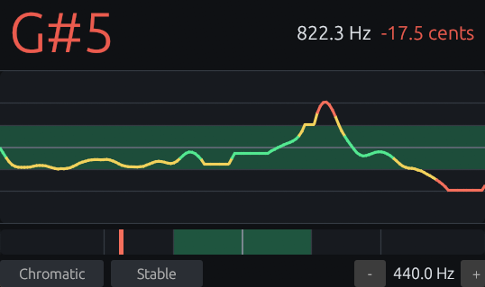

# Trace Tuner

Trace Tuner is a compact tuner plugin for musicians and producers. It listens to incoming audio, shows the detected pitch and tuning drift, and can emit the detected note as MIDI for simple audio-to-note workflows.



## Features

- Real-time monophonic pitch detection for guitar, voice, and other clear single-note sources
- Chromatic tuning mode plus a guitar-string target mode
- Stable and Fast response modes
- Tuning history graph and fine-tune meter
- A4 reference pitch from 430 Hz to 450 Hz
- Audio passthrough: the plugin does not alter the incoming signal
- Optional MIDI note output from the detected target note
- CLAP and VST3 plugin formats

## Installation

Trace Tuner is intended for modern DAWs that support CLAP or VST3 audio effects.

1. Download a [release for your platform](https://github.com/Fannon/trace-tuner/releases).
2. Install `TraceTuner.clap` and/or `TraceTuner.vst3` into your normal plugin folder.
3. Rescan plugins in your DAW.
4. Insert Trace Tuner on an audio track with a monophonic source.

## Usage

- Play one note at a time. Trace Tuner is not designed for chords or dense polyphonic material.
- Use `Chromatic` for general tuning.
- Use `Guitar` when you want the display to snap to standard guitar string targets.
- Use `Stable` for sustained tuning checks. It smooths the display and holds through short confidence dropouts as a note rings out.
- Use `Fast` for faster tracking of bends, vibrato, slides, and quick note changes. It reacts sooner, but can jump more on ambiguous input.
- Adjust `A4` if your session or instrument uses a reference other than 440 Hz.

The green zone represents roughly +/-10 cents. +/-5 cents is very tight; +/-10 cents is commonly acceptable for practical tuning, depending on instrument and context.

## MIDI Output

Trace Tuner can emit one active MIDI note based on the detected target pitch.

- CLAP supports note output directly.
- VST3 host support for MIDI/note output from audio effects varies, so routing depends on the DAW.
- MIDI output uses a stricter confidence gate than the visual display to avoid extra note chatter.
- Stable mode waits for three confirmed frames before switching notes.
- Fast mode can switch after one confirmed frame.

## Alpha Notes

This is an initial alpha release. The core tuner path is working, but expect host-specific rough edges.

Known limitations:

- Monophonic sources only
- No standalone app
- Fixed-size editor for now
- No built-in calibration workflow beyond the A4 parameter
- Tuning confidence depends strongly on input level, background noise, and note sustain

Trace Tuner was developed with AI assistance. Code, behavior, and release artifacts are still reviewed and maintained by the project author.

## Development

Build release plugins with the GUI enabled:

```sh
cargo xtask bundle trace_tuner --release --features gui
```

For local drop-in builds with timestamped snapshots:

```sh
bash build.sh
```

On Windows:

```bat
build.bat
```

The scripts copy the latest bundles to `bin/` and create snapshots under `tmp/release_YYYYMMDD_HHMMSS/`.

On Windows during local testing, the easiest drop-in artifact is:

```text
bin/TraceTuner.clap
```

Verify before release:

```sh
cargo fmt --check
cargo test
cargo clippy --all-targets --all-features -- -D warnings
```
